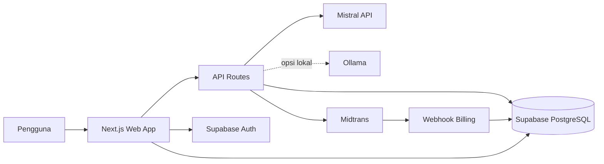

# AlurDao

Platform penerjemahan novel China berbasis AI yang menjaga kelancaran bahasa Indonesia, konteks genre, dan konsistensi istilah antarbab.

AlurDao mendukung Xianxia, Xuanhuan, Wuxia, Qihuan, Mohuan, dan Kehuan. Aplikasi dibangun sebagai modular monolith menggunakan Next.js, TypeScript, Supabase PostgreSQL, dan adapter provider LLM.

> Membawa kisah Tiongkok mengalir dalam bahasamu.

## Daftar isi

- [Tentang proyek](#tentang-proyek)
- [Status pengembangan](#status-pengembangan)
- [Arsitektur](#arsitektur)
- [Teknologi](#teknologi)
- [Quick start](#quick-start)
- [Konfigurasi environment](#konfigurasi-environment)
- [Fitur utama](#fitur-utama)
- [Paket pengguna](#paket-pengguna)
- [Autentikasi](#autentikasi)
- [Provider AI](#provider-ai)
- [API](#api)
- [Database dan migration](#database-dan-migration)
- [Pengujian](#pengujian)
- [Troubleshooting](#troubleshooting)
- [Struktur direktori](#struktur-direktori)

## Tentang proyek

AlurDao membantu penerjemah dan pembaca mengubah naskah novel Mandarin menjadi bahasa Indonesia yang lebih alami. Sistem tidak hanya menerjemahkan kata per kata, tetapi juga menggunakan genre, gaya bahasa, dan glosarium project sebagai konteks.

Project ini dikembangkan sebagai aplikasi kewirausahaan digital dengan model freemium. Pengguna dapat mencoba demo tanpa akun, membuat project pada paket Free, atau menggunakan kuota lebih besar melalui paket Premium.

AlurDao masih berada pada tahap MVP dan pengujian akademis. Integrasi pembayaran production, SMTP khusus, dan deployment publik memerlukan konfigurasi layanan eksternal.

## Status pengembangan

| Area | Status | Keterangan |
|---|---|---|
| Landing page dan demo | Selesai | Dua percobaan per browser dalam 24 jam |
| Email dan password | Selesai | Daftar, masuk, logout, dan reset password |
| Google OAuth | Sebagian teruji | Redirect ke Google berhasil; pengujian consent sampai Studio memerlukan interaksi akun |
| Project dan bab | Selesai | CRUD, autosave, serta upload `.txt` dan `.md` |
| Glosarium | Selesai | Bank global dan istilah khusus project |
| Mistral | Selesai | Provider utama development saat ini |
| Evaluasi enam genre | Selesai | Enam dari enam pemeriksaan otomatis lulus |
| Supabase Cloud | Selesai | Migration `001` sampai `010` telah tersinkron |
| Premium dan Midtrans | Placeholder | UI paket aktif untuk demo; checkout nyata dinonaktifkan sampai `MIDTRANS_ENABLE_REAL_CHECKOUT=true` |
| Monitoring API | Selesai | Dashboard admin dan pencatatan request/error |
| Dokumentasi API | Selesai | Swagger UI di `/docs/api` dan JSON OpenAPI di `/api/openapi` |
| Ollama lokal | Disiapkan | Belum diuji karena model lokal belum diunduh |

Catatan perkembangan rinci tersedia di [`PROGRESS.md`](./PROGRESS.md).

## Arsitektur



Frontend, API route, dan logika aplikasi berada dalam satu project Next.js. Supabase menyediakan autentikasi serta database hosted. Provider AI dan Midtrans merupakan layanan eksternal yang dipanggil melalui backend.

### Alur terjemahan

```text
Pengguna menempel atau mengunggah naskah
  -> memilih genre, gaya, dan glosarium
  -> API memvalidasi sesi serta kuota
  -> provider AI menerjemahkan naskah
  -> hasil, riwayat, dan penggunaan kuota disimpan
  -> pengguna menyunting atau menyalin hasil
```

## Teknologi

| Bagian | Teknologi | Peran |
|---|---|---|
| Aplikasi web | Next.js 16, React 19, TypeScript | UI, server rendering, dan API route |
| Database | Supabase PostgreSQL | Project, bab, glosarium, kuota, billing, monitoring |
| Autentikasi | Supabase Auth | Email/password, reset password, dan Google OAuth |
| AI | Mistral, Gemini, Groq, Ollama | Provider terjemahan yang dapat dipilih melalui environment |
| Validasi | Zod | Validasi request dan kontrak data |
| Pembayaran | Midtrans Snap | Checkout Premium dan notifikasi pembayaran |
| Ikon UI | Lucide React | Ikon antarmuka |

## Quick start

### Prasyarat

- Node.js 20 atau lebih baru
- npm
- Project Supabase Cloud
- API key Mistral untuk terjemahan nyata

Docker tidak diperlukan jika aplikasi menggunakan Supabase Cloud.

### Clone repository

```powershell
git clone https://github.com/YonaldiEp/AlurDao.git
cd AlurDao
```

### Instal dependency

```powershell
npm install
```

### Buat environment lokal

```powershell
Copy-Item .env.example .env.local
```

Isi konfigurasi minimal Supabase dan Mistral, kemudian jalankan:

```powershell
npm run dev
```

Buka `http://localhost:3000`. Jika port tersebut sedang digunakan, jalankan:

```powershell
npm run dev -- -p 3030
```

Lalu buka `http://localhost:3030`.

### Build production lokal

```powershell
npm run lint
npm run build
npm run start
```

## Konfigurasi environment

Gunakan `.env.example` sebagai template. Jangan commit `.env.local` atau secret asli.

### Konfigurasi minimal

```dotenv
NEXT_PUBLIC_SUPABASE_URL=https://PROJECT_REF.supabase.co
NEXT_PUBLIC_SUPABASE_PUBLISHABLE_KEY=publishable-key

AI_PROVIDER=mistral
MISTRAL_API_KEY=mistral-api-key
MISTRAL_MODEL=mistral-small-latest

DEMO_COOKIE_SECRET=secret-acak-minimal-32-karakter
```

### Konfigurasi billing

```dotenv
MIDTRANS_ENABLE_REAL_CHECKOUT=false
SUPABASE_SERVICE_ROLE_KEY=service-role-server-only
MIDTRANS_SERVER_KEY=server-key-sandbox
MIDTRANS_IS_PRODUCTION=false
PREMIUM_PRICE_IDR=49000
```

Secara default billing berjalan sebagai placeholder untuk demo/presentasi. Tombol Premium tidak membuka halaman pembayaran nyata selama `MIDTRANS_ENABLE_REAL_CHECKOUT` bukan `true`.

`SUPABASE_SERVICE_ROLE_KEY`, `MIDTRANS_SERVER_KEY`, dan API key LLM hanya boleh digunakan pada server. Jangan menggunakan prefix `NEXT_PUBLIC_` pada secret tersebut.

### Konfigurasi provider lain

```dotenv
GEMINI_API_KEY=
GEMINI_MODEL=gemini-2.5-flash

GROQ_API_KEY=
GROQ_MODEL=qwen/qwen3-32b

OLLAMA_BASE_URL=http://localhost:11434/v1
OLLAMA_MODEL=qwen3:4b
```

## Fitur utama

### Landing page dan demo

- Demo tanpa akun dengan batas dua percobaan per 24 jam.
- Maksimal 500 karakter untuk setiap percobaan.
- Pilihan enam genre dan empat gaya bahasa: Natural, Dramatis, Formal, dan Ringan.
- Cookie penggunaan ditandatangani HMAC dan disimpan sebagai `HttpOnly`.

Cookie hanya menjadi pencegahan penyalahgunaan ringan. Deployment publik tetap disarankan menambahkan rate limit berbasis IP atau penyimpanan server.

### Studio penerjemahan

- Membuat dan menghapus project.
- Membuat, memilih, dan menghapus bab.
- Autosave teks sumber dan hasil terjemahan.
- Upload naskah UTF-8 berformat `.txt` atau `.md`, maksimal 1 MB.
- Pilihan enam genre dan empat gaya terjemahan.
- Shortcut `Ctrl+Enter` atau `Cmd+Enter` untuk menerjemahkan.
- Konfirmasi sebelum mengosongkan atau mengganti naskah.
- Tampilan responsif dengan drawer project pada perangkat mobile.
- Tema terang, gelap, atau mengikuti sistem.
- Pilihan skala tampilan Auto, 100%, 112%, dan 125%.

### Glosarium

- Bank kosakata global berdasarkan genre.
- Pencarian istilah Mandarin, pinyin, atau terjemahan Indonesia.
- Override istilah untuk setiap project.
- Pemindaian istilah bab menggunakan AI.
- Pilih banyak istilah dari bank kosakata, lalu tambahkan ke project sekaligus.
- Ringkasan jumlah istilah project, istilah yang masih bisa ditambahkan, dan istilah yang sedang dipilih.
- Glosarium dikirim bersama request agar terjemahan konsisten.

### Monitoring

Admin dapat membuka `/admin/monitoring` untuk melihat maksimal 200 request terbaru, termasuk:

- jumlah request;
- jumlah error;
- durasi rata-rata;
- karakter input;
- provider dan model;
- kode error dan status HTTP.

## Paket pengguna

| Paket | Project | Bab per project | Kuota | Batas per request |
|---|---:|---:|---:|---:|
| Demo | Tidak disimpan | Tidak disimpan | 2 percobaan/24 jam | 500 karakter |
| Free | 2 | 10 | 15.000 karakter/bulan | 5.000 karakter |
| Premium | 10 | 100 | 100.000 karakter/30 hari | 10.000 karakter |
| Admin | Tidak dibatasi kuota bulanan | Sesuai konfigurasi | Tidak dibatasi | 20.000 karakter |

Kuota dicadangkan secara atomik sebelum request dikirim ke provider. Jika provider gagal, reservasi dikembalikan. Plan dan limit tidak dapat diubah pengguna melalui browser.

Untuk tahap demo, Premium masih placeholder: pengguna dapat melihat paket dan menekan tombol simulasi checkout, tetapi aplikasi tidak membuat transaksi Midtrans nyata. Jika integrasi nyata diaktifkan, Premium menggunakan pembayaran satu kali untuk masa aktif 30 hari dan tidak diperpanjang otomatis. Notification URL Midtrans production diarahkan ke:

```text
https://DOMAIN/api/billing/midtrans-notification
```

## Autentikasi

### Email dan password

Supabase Auth menangani pendaftaran, login, sesi, dan logout. Password minimal terdiri dari delapan karakter.

### Reset password

1. Pengguna membuka `/auth/forgot-password`.
2. Supabase mengirim tautan reset ke email.
3. Callback PKCE membuat sesi recovery.
4. Pengguna membuat password baru di `/auth/update-password`.

Tambahkan URL development dan production ke **Supabase Dashboard > Authentication > URL Configuration > Redirect URLs**:

```text
http://localhost:3000/**
http://localhost:3030/**
https://DOMAIN/**
```

Email bawaan Supabase sesuai untuk pengujian terbatas. Gunakan Custom SMTP sebelum production.

### Google OAuth

Callback Google untuk Supabase hosted:

```text
https://PROJECT_REF.supabase.co/auth/v1/callback
```

Konfigurasikan Client ID dan Client Secret melalui **Supabase Dashboard > Authentication > Providers > Google**. Redirect aplikasi setelah OAuth ditangani oleh `/auth/callback` dan diteruskan ke `/studio`.

## Provider AI

Provider dipilih melalui `AI_PROVIDER`:

```text
demo | mistral | gemini | groq | ollama
```

Mistral menjadi provider utama development saat ini:

```dotenv
AI_PROVIDER=mistral
MISTRAL_API_KEY=api-key
MISTRAL_MODEL=mistral-small-latest
```

Ollama telah memiliki adapter, tetapi belum menjadi kebutuhan development. Setelah Ollama tersedia:

```powershell
ollama pull qwen3:4b
ollama serve
```

## API

Semua endpoint aplikasi mengembalikan JSON menggunakan envelope yang konsisten.

### Endpoint utama

| Method | Endpoint | Autentikasi | Fungsi |
|---|---|---|---|
| `POST` | `/api/translate` | Wajib | Menerjemahkan teks dan mencatat kuota |
| `GET` | `/api/glossary` | Sesuai RLS | Mencari bank kosakata |
| `POST` | `/api/glossary/extract` | Wajib | Mengekstrak istilah dengan AI |
| `GET/POST` | `/api/demo/translate` | Tidak | Demo dengan cookie limit |
| `POST` | `/api/billing/checkout` | Wajib | Placeholder checkout Premium; membuat transaksi Midtrans hanya jika real checkout diaktifkan |
| `POST` | `/api/billing/midtrans-notification` | Signature Midtrans | Memproses status pembayaran |
| `GET` | `/api/openapi` | Tidak | Mengambil spesifikasi OpenAPI 3.1 |

Dokumentasi interaktif tersedia di:

```text
http://localhost:3000/docs/api
```

File JSON OpenAPI dapat dibuka langsung di:

```text
http://localhost:3000/api/openapi
```

### Contoh response sukses

```json
{
  "success": true,
  "data": {
    "translation": "Hasil terjemahan",
    "provider": "Mistral",
    "model": "mistral-small-latest"
  },
  "meta": {
    "requestId": "uuid",
    "timestamp": "2026-07-02T00:00:00.000Z",
    "durationMs": 1255
  }
}
```

Response gagal menggunakan `success: false` dan objek `error` berisi `code`, `message`, serta detail aman.

## Database dan migration

Database menggunakan PostgreSQL hosted dari Supabase dengan Row Level Security. Pengguna hanya dapat mengakses profile, project, bab, glosarium, pembayaran, subscription, dan riwayat miliknya sendiri.

### Entitas utama

| Tabel | Fungsi |
|---|---|
| `profiles` | Profile, plan, limit, dan penggunaan karakter |
| `projects` | Metadata novel dan konfigurasi terjemahan |
| `chapters` | Teks sumber, hasil, dan status bab |
| `glossary_entries` | Istilah khusus project |
| `glossary_terms` | Bank kosakata global |
| `translation_runs` | Riwayat terjemahan |
| `translation_quota_reservations` | Reservasi kuota atomik |
| `payments` | Transaksi pembayaran Premium |
| `subscriptions` | Masa aktif Premium |
| `api_usage_events` | Monitoring request dan error API |

### Status migration

Migration `202607010001` sampai `202607020010` telah diterapkan pada Supabase Cloud.

Untuk project Supabase lain:

```powershell
npx supabase login
npx supabase link --project-ref PROJECT_REF
npx supabase db push
```

## Pengujian

### Pemeriksaan kode

```powershell
npm run lint
npm run build
```

Catatan audit 15 Juli 2026: asset vendor Swagger di `public/swagger-ui/`, cache Supabase lokal, laporan test, dan hasil evaluasi lokal diabaikan oleh Git agar repository tetap bersih. Landing page, auth, docs API, OpenAPI JSON, asset Swagger, dan responsivitas mobile/tablet telah dicek melalui server lokal. Area Studio juga diperkuat dengan ellipsis judul panjang, toolbar yang wrap, dan select yang tidak melebar keluar panel.

### Evaluasi Mistral

```powershell
npm run evaluate:mistral
```

Dataset berada di `evaluation/cases.json`. Laporan terbaru ditulis ke `evaluation/results/mistral-latest.json`.

Hasil 2 Juli 2026:

| Pemeriksaan | Hasil |
|---|---:|
| Genre yang diuji | 6 |
| Lulus otomatis | 6 |
| Gagal | 0 |
| Pass rate | 100% |

Pemeriksaan otomatis mencakup output kosong, source-copy, istilah wajib, repetisi, dan istilah asing terlarang. Penilaian manusia tetap diperlukan untuk nuansa serta keluwesan prosa.

## Troubleshooting

### Konfigurasi Supabase belum tersedia

Pastikan `.env.local` berisi `NEXT_PUBLIC_SUPABASE_URL` dan `NEXT_PUBLIC_SUPABASE_PUBLISHABLE_KEY`, kemudian restart server development.

### Google Login tidak kembali ke Studio

Periksa Redirect URLs Supabase, origin aplikasi Google OAuth, dan callback hosted Supabase. Pastikan protokol, domain, dan port sama persis.

### Email reset tidak diterima

- Periksa folder spam.
- Pastikan redirect URL diizinkan Supabase.
- Periksa batas pengiriman email bawaan Supabase.
- Gunakan Custom SMTP untuk production.

### Billing masih placeholder

Ini perilaku default untuk demo. Jika ingin mengaktifkan pembayaran nyata, set:

```dotenv
MIDTRANS_ENABLE_REAL_CHECKOUT=true
MIDTRANS_SERVER_KEY=server-key-sandbox-atau-production
SUPABASE_SERVICE_ROLE_KEY=service-role-server-only
```

### Pembayaran menampilkan `BILLING_NOT_CONFIGURED`

Error ini hanya relevan setelah `MIDTRANS_ENABLE_REAL_CHECKOUT=true`. Isi `MIDTRANS_SERVER_KEY` dan `SUPABASE_SERVICE_ROLE_KEY` pada environment server. Gunakan key Sandbox selama development.

### Mistral tidak dapat dihubungi

Periksa `MISTRAL_API_KEY`, `MISTRAL_MODEL`, koneksi internet, serta batas penggunaan akun Mistral.

### Port sudah digunakan

```powershell
netstat -ano | Select-String ':3000|:3030'
npm run dev -- -p 3030
```

### Migration Cloud berbeda dengan lokal

```powershell
npx supabase migration list
npx supabase db push
```

## Struktur direktori

```text
AlurDao/
├── evaluation/                 # Dataset dan laporan evaluasi AI
├── public/                     # Asset statis
├── scripts/                    # Runner evaluasi
├── src/
│   ├── app/
│   │   ├── admin/              # Monitoring admin
│   │   ├── api/                # Translate, demo, glossary, billing
│   │   ├── auth/               # Login, callback, reset password
│   │   ├── billing/            # Halaman paket Premium
│   │   ├── docs/               # Dokumentasi Swagger/OpenAPI
│   │   └── studio/             # Workspace penerjemahan
│   ├── components/             # Komponen UI dan workspace
│   ├── config/                 # Konfigurasi genre
│   └── lib/
│       ├── ai/                 # Adapter dan kontrak provider AI
│       ├── api/                # Envelope response JSON
│       ├── demo/               # Cookie limit demo
│       └── supabase/           # Client browser dan server
├── supabase/
│   ├── migrations/             # Skema PostgreSQL dan RLS
│   ├── config.toml             # Konfigurasi Supabase lokal
│   └── seed.sql                # Data awal
├── .env.example                # Template environment
├── PROGRESS.md                 # Status pengembangan
├── README.md                   # Dokumentasi utama
└── package.json                # Script dan dependency
```

## Catatan keamanan

- Jangan commit `.env.local` atau secret provider.
- Jangan mengekspos Service Role Key ke browser.
- RLS harus tetap aktif pada semua tabel data pengguna.
- Webhook Midtrans harus memverifikasi signature dan nominal pembayaran.
- Deployment publik memerlukan HTTPS, Custom SMTP, monitoring, dan rate limiting tambahan.
- Jangan commit cache `.next`, runtime Supabase lokal, asset Swagger hasil generate, atau hasil evaluasi lokal.
